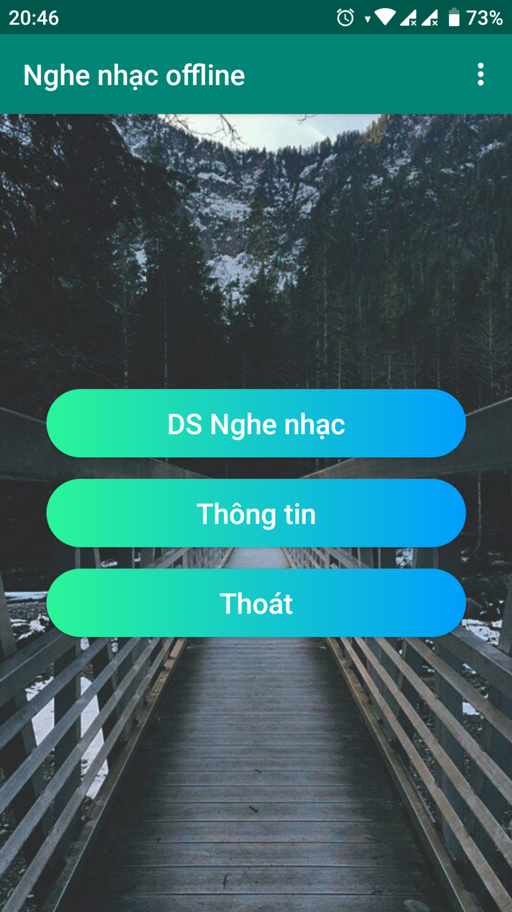
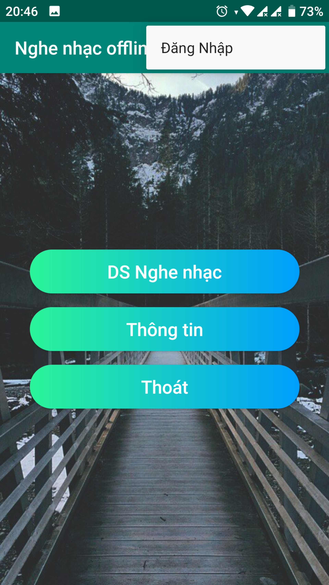
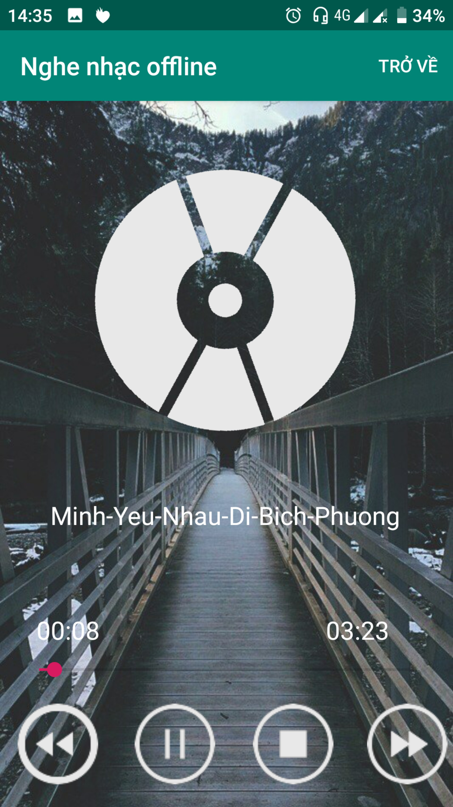

# Hướng dẫn sử dụng App Nghe Nhạc Offline

* Sau khi cài đặt ứng dụng có phần giao diện như sau:  

 

* Giao diện chính gốm có 3 nút là: DS Nghe nhạc, Thông tin và Thoát. 

* Bên phải góc trên cùng màn hình có dấu 3 chấm, là menu chứa liên kết đăng nhập:  

 

* Click vào nút đăng nhập thì sẽ qua trang mới như sau

 

* Nếu chúng ta không muốn đăng nhập thì click vào nút "trở về" ở phía bên phải góc trên cùng màn hình. 

* Nếu chúng ta chưa có tài khoản thì click vào "Register" phía dưới nút LOGIN. 

* Và sau đây là giao diện màn hình đăng ký. 

 

* Sau khi đăng kí xong thì tự động sẽ chuyển qua màn hình đăng nhập. 

* Sau khi đăng nhập xong thì tự động sẽ chuyển về lại màn hình chính. 

* Khi click vào DS Nghe Nhạc. 

 

* App sẽ hỏi người dùng về sự cho phép truy cập vào bộ nhớ. 

* Nếu người dùng chọn "TỪ CHỐI", người dùng sẽ không truy cập vào DS Nghe Nhạc. 

* Nếu người dùng chọn "CHO PHÉP", DS Nghe Nhạc sẽ dùng những bài hát có trong bộ nhớ và đưa vào App. 

* Người dùng chọn bài hát bất kì để thưởng thức. 

 

* Ở giao diện này có 4 nút prev, next, play và stop. 

* Khi người dùng chọn bài hát thì tự động sẽ phát nhạc, vì thế trên giao diện sẽ hiện nút pause. 

* Tiếp theo, ở giao diện màn hình chính nút Thông Tin sẽ cho người dùng biết thông tin về App. 

 

* Và nút Thoát cho phép người dùng thoát App.

# Update 27-5-2019 11:10PM  
* Add list_audio.java  
* Add activity_list_audio.xml  
* Add first.png, second.png for activity_main.xml and activity_list_audio  
------------------------ 
# Update 1-6-2019 7:43PM  
* Modify icon App  
* Create and add PageView About  
* Make effect move to the pages  
* Modify and Sort PageView: "activity_music.xml", "activity_play_music.xml", "song_layout.xml"  
# Update final 10-6-2019 12:19AM  
* Add menu_example "Trở Về"
* Add background for Main menu
* Fixed button "Thoat"
